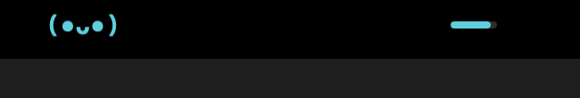
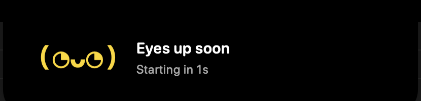
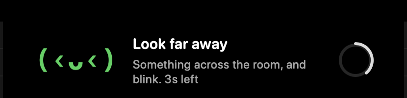
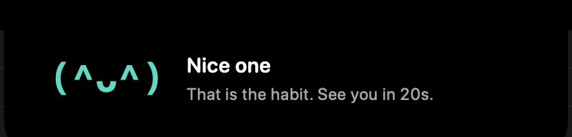
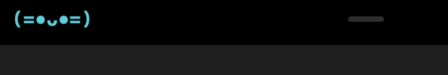

# Notch Eye Pet

A pet lives in your MacBook's notch and comes out to make you look away from the screen.

While you work it sits beside the notch, blinking, with a quiet progress hint on the other side:



When a break is near it peeks out. During the break it demonstratively looks away from the screen, which is the thing it is asking you to do, and if you actually stop typing it celebrates:





## Why

Every eye-break app on macOS is a menu bar timer that blurs your screen. Those get disabled in week two, and the research says that matters more than the schedule does. A [2023 trial](https://www.sciencedirect.com/science/article/pii/S1367048422001990) found sustained break reminders improved dry-eye symptoms, and that the benefit disappeared within a week of the reminders stopping, while a [separate 2023 study](https://pubmed.ncbi.nlm.nih.gov/36473088/) found the specific "20-20-20" numbers made no measurable difference at all.

So the schedule is a preference and **staying installed is the product**. Hence a creature you like, in pixels you were not using, instead of software that takes your screen away. The break copy says "and blink" because blinking is what actually moved the dry-eye scores.

## Timers that are actually correct

Most break timers fire at an empty desk, or never fire while you watch a 40-minute video. This one reads three states:

- **absent** — no input and nothing holding the display awake, or the screen is locked. Pauses and decays; a break that comes due while you are away is banked silently instead of fired at an empty chair.
- **passive** — no input, but something holds `PreventUserIdleDisplaySleep`. You are watching or reading. Still screen time, keeps accruing.
- **active** — recent input.

It needs **no permissions at all**: no Accessibility grant, no event tap, no camera. Idle detection uses `CGEventSource` recency per event type, which also gives the pet its personality for free — it grazes when you scroll, gets busy when you type, and watches alongside you during video.

## The pet

Text glyphs, not sprites. Every mood is a small monospaced face animated by frame stepping, so it is crisp at notch size, free of asset licensing, and trivially extensible. Four species ship, each with its own personality:

| | |
|---|---|
| **Dot** `(•ᴗ•)` | the default; bobs, blinks irregularly, glances around when idle |
| **Cat** `(=•ᴗ•=)` | whisker cheeks, contented squints |
| **Robo** `[■_■]` | never blinks; its idle quirk is an eye flicker like a status LED |
| **Owl** `(ʘᴗʘ)` | holds perfectly still; blinks slowly and deliberately |



Pick a species in Settings. Idle quirks are hard rate-limited (at most once per few minutes) because a pet that performs constantly is a pet you disable.

## Features

- Break schedule presets plus a custom editor (work interval, break length, warning lead) in Settings; everything persists
- Local streaks and stats in the menu bar ("Today: 3 taken · 1 missed") — a self-honesty signal, never telemetry
- Launch at login, optional soft sound at break start (off by default)
- Battery-aware: the poll loop backs off while you are away

## Install

Download `NotchEyePet.zip` from the [latest release](https://github.com/itsmaleen/notch-eye-pet/releases/latest), unzip it, and drag `NotchEyePet.app` into `/Applications`. Universal binary, so Apple Silicon and Intel both work. macOS 13 or later.

Or from a terminal:

```bash
curl -L -o /tmp/NotchEyePet.zip https://github.com/itsmaleen/notch-eye-pet/releases/latest/download/NotchEyePet.zip
unzip -o -q /tmp/NotchEyePet.zip -d /Applications
open /Applications/NotchEyePet.app
```

Look for the eye icon in the menu bar. There is no Dock icon: it is an accessory app by design.

## Build

```bash
swift build && swift test          # pure-logic engine tests
./Scripts/run.sh                    # bundles and launches the .app
./.build/debug/NotchEyePet --probe  # headless signal dump
```

Pick "Debug fast (20 s / 5 s)" from the menu bar unless you want to wait 20 minutes to see a break.

### Cutting a release

`Scripts/release.sh` builds a universal bundle, signs it with a Developer ID, notarizes it, and staples the ticket. Signing config is read from `Scripts/signing.env`, which is gitignored:

```bash
NOTCH_SIGNING_IDENTITY="Developer ID Application: Your Name (TEAMID)"
NOTCH_NOTARY_PROFILE="notch-eye-pet"
```

Create the notary profile once with `xcrun notarytool store-credentials`. Without notarization Gatekeeper rejects the download, so the staple is not optional.

## Docs

- `CLAUDE.md` — architecture, constraints, and the reasoning behind the non-obvious choices
- `PLAN.md` — phased build plan
- `TODO.md` — what to pick up next

## Credits

Notch rendering by [DynamicNotchKit](https://github.com/MrKai77/DynamicNotchKit) (MIT).
